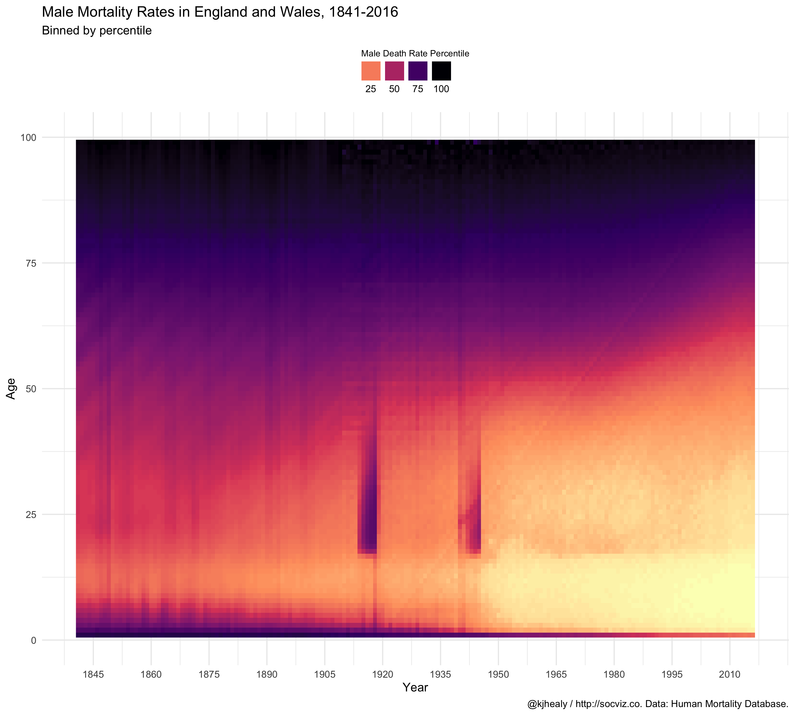

<!-- README.md is generated from README.Rmd. Please edit that file -->


# demog

<!-- badges: start -->
[](https://travis-ci.org/kjhealy/demog)
<!-- badges: end -->

Some demographic data, for teaching purposes. Please do not distribute this package. For the original mortality data, consult <http://mortality.org> and follow the instructions there.

## Installation

`demog` is a data package. 

### Install direct from GitHub

You can install the beta version of demog from [GitHub](https://github.com/kjhealy/demog) with:

``` r
devtools::install_github("kjhealy/demog")
```

### Installation using `drat`

While using `install_github()` works just fine, it would be nicer to be able to just type `install.packages("demog")` or `update.packages("demog")` in the ordinary way. We can do this using Dirk Eddelbuettel's [drat](http://eddelbuettel.github.io/drat/DratForPackageUsers.html) package. Drat provides a convenient way to make R aware of package repositories other than CRAN.

First, install `drat`:


```r
if (!require("drat")) {
    install.packages("drat")
    library("drat")
}
```

Then use `drat` to tell R about the repository where `demog` is hosted:


```r
drat::addRepo("kjhealy")
```

You can now install `demog`:


```r
install.packages("demog")
```

To ensure that the `demog` repository is always available, you can add the following line to your `.Rprofile` or `.Rprofile.site` file:


```r
drat::addRepo("kjhealy")
```

With that in place you'll be able to do `install.packages("demog")` or `update.packages("demog")` and have everything work as you'd expect. 

Note that the drat repository only contains data packages that are not on CRAN, so you will never be in danger of grabbing the wrong version of any other package.


## Loading the data

The package works best with the [tidyverse](http://tidyverse.org/) libraries.


```r
library(tidyverse)
```

Load the data:


```r
library(demog)
```


```r
okboomer
#> # A tibble: 1,644 x 12
#>     year month n_days births total_pop births_pct births_pct_day date      
#>    <dbl> <dbl>  <dbl>  <dbl>     <dbl>      <dbl>          <dbl> <date>    
#>  1  1938     1     31  51820  41215000    0.00126           40.6 1938-01-01
#>  2  1938     2     28  47421  41215000    0.00115           41.1 1938-02-01
#>  3  1938     3     31  54887  41215000    0.00133           43.0 1938-03-01
#>  4  1938     4     30  54623  41215000    0.00133           44.2 1938-04-01
#>  5  1938     5     31  56853  41215000    0.00138           44.5 1938-05-01
#>  6  1938     6     30  53145  41215000    0.00129           43.0 1938-06-01
#>  7  1938     7     31  53214  41215000    0.00129           41.6 1938-07-01
#>  8  1938     8     31  50444  41215000    0.00122           39.5 1938-08-01
#>  9  1938     9     30  50545  41215000    0.00123           40.9 1938-09-01
#> 10  1938    10     31  50079  41215000    0.00122           39.2 1938-10-01
#> # … with 1,634 more rows, and 4 more variables: seasonal <dbl>,
#> #   trend <dbl>, remainder <dbl>, country <chr>
```


```r
britain
#> # A tibble: 19,536 x 5
#>     year   age  female    male   total
#>    <dbl> <int>   <dbl>   <dbl>   <dbl>
#>  1  1841     0 0.136   0.169   0.153  
#>  2  1841     1 0.0596  0.0632  0.0614 
#>  3  1841     2 0.0364  0.0370  0.0367 
#>  4  1841     3 0.0249  0.0261  0.0255 
#>  5  1841     4 0.0185  0.0191  0.0188 
#>  6  1841     5 0.0140  0.0143  0.0141 
#>  7  1841     6 0.0109  0.0112  0.0110 
#>  8  1841     7 0.00859 0.00898 0.00879
#>  9  1841     8 0.00686 0.00725 0.00705
#> 10  1841     9 0.00577 0.00605 0.00591
#> # … with 19,526 more rows
```

## Example


```r
library(dplyr)
library(ggplot2)

britain %>%
    filter(age < 101) %>%
    ggplot(aes(x = year, y = age, fill = ntile(male, 100))) +
    geom_raster() +
    scale_fill_viridis_c(option = "A", direction = -1) +
    scale_x_continuous(breaks = seq(1845, 2015, by = 15)) +
    ylim(c(0, 100)) +
        guides(fill = guide_legend(nrow = 1, title.position = "top", label.position = "bottom")) +
    labs(x = "Year", y = "Age", fill = "Male Death Rate Percentile",
         title = "Male Mortality Rates in England and Wales, 1841-2016",
         subtitle = "Binned by percentile",
         caption = "@kjhealy / http://socviz.co. Data: Human Mortality Database.") +
    theme_minimal()  + 
    theme(legend.position = "top",
          legend.title = element_text(size = 8)) 
```


